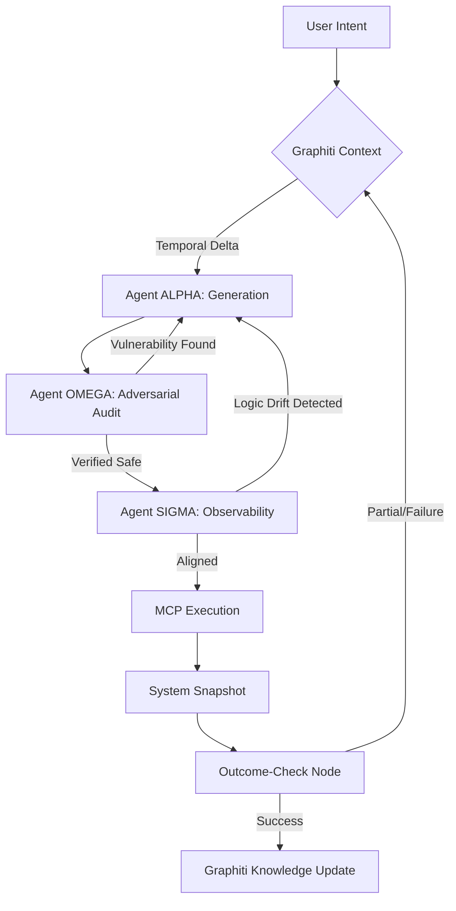

# PROJECT AETHER: System Design Document (Phase 1)
## Autonomous Engineering & Temporal Health Evaluation Resource

### I. Modular Directory Architecture
Designed for strict Dependency Injection and model agnosticism.

```text
aether/
├── cmd/                # Entry points and CLI dashboard
├── core/               # Orchestration & State Management
│   ├── graph.py        # LangGraph cyclic definitions
│   ├── state.py        # AetherState & TypedDicts
│   └── outcome.py      # Outcome-Check & Pruning logic
├── agents/             # Multi-Agent Swarm (The Triad)
│   ├── alpha/          # The Architect: Engineering & Synthesis
│   ├── omega/          # The Adversary: Red-Teaming & Audit
│   └── sigma/          # The Observer: Tracing & Logic Drift
├── transport/          # OS & Protocol Bridge
│   ├── mcp_bridge.py   # MCP implementation (MicroVM/Container)
│   └── security.py     # Zero-Trust execution gates
├── memory/             # Temporal Knowledge Graph
│   ├── graphiti_v2.py  # Graphiti Temporal reasoning
│   └── delta.py        # Delta-Analysis & Regression detection
├── spec/               # Efficiency & Logic Specs
│   └── tir_engine.py   # Tension-Based Intermediate Representation
└── config/             # Dependency Injection & Model Registry
```

### II. System Workflow (Mermaid.js)


### III. Agent OMEGA: "Hacker" Logic & Red-Teaming Plan
Agent OMEGA doesn't just check for syntax; it operates as a proactive Red-Teamer using **Chain-of-Failure** analysis:
1.  **Attack Graph Synthesis**: OMEGA maps the proposed code against a "Lateral Movement" database. It asks: "If this function fails, what does it expose?"
2.  **Permutation Fuzzing**: Autonomously generates edge-case inputs that aim to trigger memory leaks or buffer overflows in the ALPHA-generated C/Python extensions.
3.  **Dependency Poisoning Check**: Scans all proposed third-party resolutions for "Shadow Dependencies" and version-pinning vulnerabilities.
4.  **Escalation Logic**: If ALPHA requests a permission change (e.g., `chmod +x`), OMEGA immediately simulates a local privilege escalation scenario to see if the change is strictly necessary.

### IV. Foundational `pyproject.toml`
```toml
[project]
name = "project-aether"
version = "2026.1.0"
description = "Autonomous Engineering & Temporal Health Evaluation Resource"
requires-python = ">=3.12"
dependencies = [
    "langgraph>=0.2.35",      # Stateful Agentic Loops
    "graphiti-sdk>=1.2.0",    # Temporal Knowledge Graph
    "mcp>=0.12.0",            # Model Context Protocol
    "langfuse>=2.0.0",        # Deep Tracing
    "arize-phoenix>=4.0.0",   # Observability & Evaluations
    "pydantic>=2.10.0",       # Data Validation
    "rich>=13.9.0",           # Terminal UI
    "psutil>=6.1.0",          # Resource Guard (TIR)
    "instructor>=1.6.0",      # Structured Outputs
    "networkx>=3.4.0"         # Graph Analysis for OMEGA
]

[tool.setuptools.packages.find]
where = ["."]
include = ["aether*"]
```

### V. Chain-of-Thought Audit (Architectural Reflection)
*   **Potential Bottleneck**: The recursive loop between ALPHA and OMEGA could enter an infinite "Audit-Fix" cycle.
    *   *Solution*: Implement a "Strategy Pivot" bit in the `AetherState`. If a loop exceeds 3 iterations, SIGMA forces a logic rewrite rather than a patch.
*   **Security Risk**: MCP bridge execution on the host OS.
    *   *Solution*: Mandatory Shadow-Mode. All commands are first executed in a disposable container (Digital Twin) before the Outcome-Check node promotes them to the primary workspace.
*   **State-Bloat**: Recursive temporal graphs can grow exponentially.
    *   *Solution*: TIR Specification "Sparse Activation." Prune nodes that have zero reachability from the current "User Intent" vector.
# PROJECT AETHER: Chain-of-Thought Architectural Audit
**Status**: INTERNAL ARCHITECT REVIEW (LVL 8)

## 1. Recursive Logic Loop Analysis
**Vulnerability**: The ALPHA-OMEGA loop (Generation -> Audit -> Fix) is prone to "Stall-Cycles" where OMEGA rejects minor stylistic choices or ALPHA fails to reconcile a security constraint with a functional requirement.

**Mitigation Strategy**:
- **Outcome-Check Node (OCN)**: Acts as a circuit breaker. If the delta between iteration $N$ and $N-1$ is < 5% in terms of security score or functional coverage, the OCN triggers a *Paradigm Shift*.
- **Strategy Pivot**: ALPHA is forced to switch its underlying approach (e.g., switching from a regex-based parser to a PEG parser) rather than iterating on the failed implementation.

## 2. Security Bottleneck & "Escape" Vectors
**Vulnerability**: The MCP (Model Context Protocol) is a high-privilege bridge. Even with OMEGA auditing, a "Polyglot Injection" could bypass static analysis.

**Mitigation Strategy**:
- **Digital Twin Execution (DTE)**: All code is executed in a temporary, network-isolated container. Only the *side effects* (file changes, status codes) are reported back.
- **Entropic Verification**: OMEGA will perform "Fuzz-Testing" on the MCP bridge inputs itself, ensuring that the transport layer cannot be used to leak environment variables or access unauthorized file paths.

## 3. State-Bloat & Memory Latency
**Vulnerability**: Using Graphiti for *every* event can lead to a $O(N^2)$ search space for context retrieval, degrading performance on 8GB RAM devices.

**Mitigation Strategy**:
- **TIR (Tension-Based IR) Sparse Activation**: We implement a "Decay Function" for nodes. Nodes that haven't been referenced in the last $K$ successful outcomes lose "Tension" (weight).
- **Heuristic Distillation**: Periodically, the SIGMA agent "Summarizes" stable sub-graphs into a single "Heuristic Node," pruning the raw event logs while preserving the learned system behavior.

## 4. Multi-Agent Coordination Drift
**Vulnerability**: SIGMA might flag "Logic Drift" too aggressively, leading to user-intent rejection, or too laxly, leading to silent failures.

**Mitigation Strategy**:
- **Semantic Anchor Points**: The initial User Intent is tokenized and stored as a "Fixed Anchor" in the state. SIGMA calculates the cosine similarity between the current "Proposed Outcome" and this anchor.
- **Cross-Verification**: OMEGA and SIGMA share a feedback channel. If SIGMA detects drift, OMEGA is instructed to prioritize "Intent-Alignment" in its next audit cycle.
